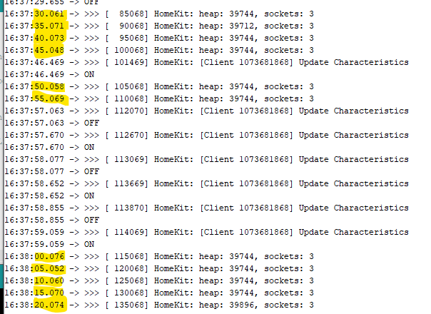

# Homekit Scheduler
Add arkhipenko's TaskScheduler based on Mixiaoxiao's Arduino-HomeKit-ESP8266
[Mixiaoxiao / Arduino-HomeKit-ESP8266](https://github.com/Mixiaoxiao/Arduino-HomeKit-ESP8266)
[arkhipenko / TaskScheduler](https://github.com/arkhipenko/TaskScheduler)

The arduino_homekit_loop() will be called every 200ms instead of loop() and print HEAP and connection status every 5sec by Scheduler.

 
